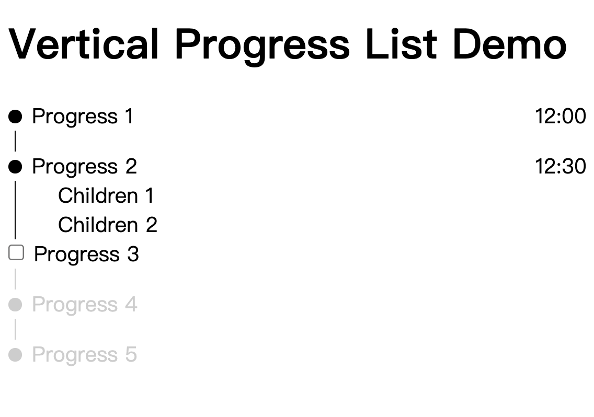

# React Vertical Steps List

[English](https://github.com/LaiJunBin/react-vertical-steps-list#react-vertical-steps-list)｜繁體中文

[DEMO](https://laijunbin.github.io/react-vertical-steps-list/index.html)



# 安裝
```
$ npm i react-vertical-steps-list
```

# 引入
```js
import { VerticalStepsList, VSL_STATUS } from 'react-vertical-steps-list'
```

## 範例
jsx:
```jsx
  <VerticalStepsList items={items} />
```


items:
```js
const items = [{
  text: 'Progress 1',
  status: VSL_STATUS.DONE,
  time: '12:00'
}, {
  text: 'Progress 2',
  time: '12:30',
  status: VSL_STATUS.DONE,
  children: [{
    text: 'Children 1'
  }, {
    text: 'Children 2'
  }]
}, {
  text: 'Progress 3',
  status: VSL_STATUS.PENDING,
  callback () {
    return new Promise(resolve => {
      setTimeout(() => {
        resolve(true)
      }, 1000)
    })
  }
}, {
  text: 'Progress 4',
  status: VSL_STATUS.COMING
}, {
  text: 'Progress 5',
  status: VSL_STATUS.COMING,
  callback () {
    return new Promise(resolve => {
      setTimeout(() => {
        alert('checked error.')
        resolve(false)
      }, 1000)
    })
  }
}]
```

## 進階範例

jsx:
```jsx
const itemFilterHandler = item => {
  if (item.text === 'Progress 1') {
    item.text = 'Filtered Progress 1'
    item.marker = <Marker />
  }

  return item
}

<VerticalStepsList
  items={items}
  textFilter={text => text + '!'}
  childFilter={text => `Filtered ${text}`}
  itemFilter={itemFilterHandler}
/>
```

items:
```js
const items = [{
  text: 'Progress 1',
  status: VSL_STATUS.DONE,
  time: '12:00',
  meta () {
    return this.time
  }
}, {
  text: 'Progress 2',
  time: '12:30',
  status: VSL_STATUS.DONE,
  children: [{
    text: 'Children 1'
  }, {
    text: 'Children 2'
  }],
  meta () {
    return this.children.length
  }
}, {
  text: 'Progress 3',
  status: VSL_STATUS.PENDING,
  callback () {
    return save().then(res => {
      this.time = res.time
    })
  },
  update () {
    this.children = [{
      text: 'New Children'
    }]
    this.text = 'Progress3 Done!'
    return this
  },
  meta () {
    return this.time
  }
}, {
  text: 'Progress 4',
  status: VSL_STATUS.COMING,
  marker: <Marker />,
  checkbox: <Checkbox />
}, {
  text: 'Progress 5',
  status: VSL_STATUS.COMING,
  callback () {
    return error().catch(err => {
      console.error(err)
      alert('checked error.')
      return false
    })
  }
}]
```

## 執行範例
```
$ git clone https://github.com/LaiJunBin/react-vertical-steps-list.git
$ cd react-vertical-steps-list
$ npm i
$ npm run start
```

開發伺服器將啟動在: http://localhost:3000

---

# 文件

VSL_Status:
值           | 描述  |
--------------|:-----:|
Done    | 表示階段已經完成 |
Pending    | 表示階段正在等待使用者回應 (Click) |
Coming  | 表示階段還沒到達 | 

VerticalStepsList:
屬性           | 描述  |
--------------|:-----:|
items    | 要產生清單的項目 |
textFilter    | 針對每個清單項目文字的過濾器函數 |
childFilter  | 針對每個清單子項目文字的過濾器函數 | 
itemFilter| 針對每個清單項目的過濾器函數 |
itemClass | 設定每個清單項目的 class  |
itemStyle | 設定每個清單項目的 style  |
childrenClass | 設定每個清單子項目的 class  |
childrenStyle |  設定每個清單子項目的 style |
darkTheme |  設定是否開啟深色主題 |


items: 一個陣列，每個item如下
```js
{
  text: '',       // 必要
  status: {status in VSL_STATUS},  // 必要
  children: [{              // 選填
    text: ''
  }],
  marker: <YourMarkerComponent />,       // 選填
  checkbox: <YourCheckboxComponent />,   // 選填
  callback() {              // 選填

  },
  update() {                // 選填

  },
  meta() {                  // 選填

  },
  // ... 更多自定義屬性
}
```

## 函數說明
函數           | 描述  |
--------------|:-----:|
callback    | 當使用者點擊後觸發的函數，如果回傳 false ，將不會進入到下一階段 |
update    | 當使用者成功進入到下一階段，你可以更新目前item的資料 |
meta  | 可以回傳要顯示在右側的文字 | 