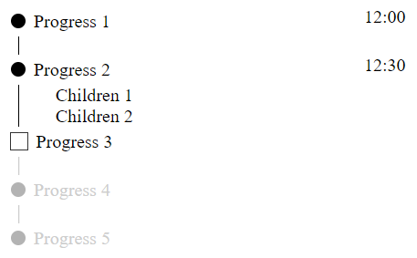

# React Vertical Steps List

English｜[繁體中文](https://github.com/LaiJunBin/react-vertical-steps-list/blob/main/README-zh-tw.md#react-vertical-steps-list)

[DEMO](https://laijunbin.github.io/react-vertical-steps-list/index.html)



# Install
```
$ npm i react-vertical-steps-list
```

# Import
```js
import { VerticalStepsList, VSL_STATUS } from 'react-vertical-steps-list'
```

## Example
jsx:
```jsx
  <VerticalStepsList items={items} />
```


items:
```js
const items = [{
  text: 'Progress 1',
  status: VSL_STATUS.DONE,
  time: '12:00'
}, {
  text: 'Progress 2',
  time: '12:30',
  status: VSL_STATUS.DONE,
  children: [{
    text: 'Children 1'
  }, {
    text: 'Children 2'
  }]
}, {
  text: 'Progress 3',
  status: VSL_STATUS.PENDING,
  callback () {
    return new Promise(resolve => {
      setTimeout(() => {
        resolve(true)
      }, 1000)
    })
  }
}, {
  text: 'Progress 4',
  status: VSL_STATUS.COMING
}, {
  text: 'Progress 5',
  status: VSL_STATUS.COMING,
  callback () {
    return new Promise(resolve => {
      setTimeout(() => {
        alert('checked error.')
        resolve(false)
      }, 1000)
    })
  }
}]
```

## Advanced Example

jsx:
```jsx
const itemFilterHandler = item => {
  if (item.text === 'Progress 1') {
    item.text = 'Filtered Progress 1'
    item.marker = <Marker />
  }

  return item
}

<VerticalStepsList
  items={items}
  textFilter={text => text + '!'}
  childFilter={text => `Filtered ${text}`}
  itemFilter={itemFilterHandler}
/>
```

items:
```js
const items = [{
  text: 'Progress 1',
  status: VSL_STATUS.DONE,
  time: '12:00',
  meta () {
    return this.time
  }
}, {
  text: 'Progress 2',
  time: '12:30',
  status: VSL_STATUS.DONE,
  children: [{
    text: 'Children 1'
  }, {
    text: 'Children 2'
  }],
  meta () {
    return this.children.length
  }
}, {
  text: 'Progress 3',
  status: VSL_STATUS.PENDING,
  callback () {
    return save().then(res => {
      this.time = res.time
    })
  },
  update () {
    this.children = [{
      text: 'New Children'
    }]
    this.text = 'Progress3 Done!'
    return this
  },
  meta () {
    return this.time
  }
}, {
  text: 'Progress 4',
  status: VSL_STATUS.COMING,
  marker: <Marker />,
  checkbox: <Checkbox />
}, {
  text: 'Progress 5',
  status: VSL_STATUS.COMING,
  callback () {
    return error().catch(err => {
      console.error(err)
      alert('checked error.')
      return false
    })
  }
}]
```

## Run example
```
$ git clone https://github.com/LaiJunBin/react-vertical-steps-list.git
$ cd react-vertical-steps-list
$ npm i
$ npm run start
```

The server will run at http://localhost:3000


# Docs

VSL_Status:
Value           | Description  |
--------------|:-----:|
Done    | step is done. |
Pending    | step waiting for user to click. |
Coming  | step coming soon. | 

VerticalStepsList:
Attribute           | Description  |
--------------|:-----:|
items    | data to generate steps list. |
textFilter    | Filter function for text of all items. |
childFilter  | Filter function for text of children in all item | 
itemFilter| Filter function for all item. |
itemClass | set class for all item.  |
itemStyle | set style for all item.  |
childrenClass | set class for children of all item.  |
childrenStyle | set style for children of all item. |
darkTheme |  set true for dark theme. |
lineColor |  set color of line.  |
hideLastLine |  set true to hide last children line.  |
defaultMarkerColor |  set color of default marker.  |
defaultCheckboxColor |  set color of default checkbox.  |
metaStyle |  set style for meta.  |
textStyle |  set style for text.  |
childStyle |  set style for child.  |

items: an Array, item like below:
```js
{
  text: '',       // required
  status: {status in VSL_STATUS},  // required
  children: [{              // optional
    text: ''
  }],
  marker: <YourMarkerComponent />,       // optional
  checkbox: <YourCheckboxComponent />,   // optional
  callback() {              // optional

  },
  update() {                // optional

  },
  meta() {                  // optional

  },
  // ... more custom data.
}
```

## Function description
Function           | Description  |
--------------|:-----:|
callback    | Triggered when user click, if you return false, the step won't go to next stage. |
update    | Triggered when the step goes to next stage, you can update item data in this funciton. |
meta  | Set text in the right side. | 